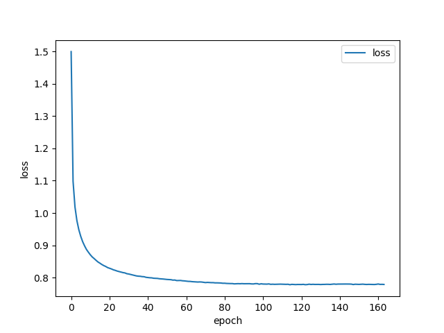
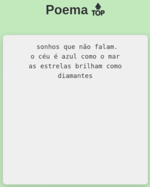

# Poema 🔝

Gerando poemas com um modelo de linguagem simples autoregressivo, utilizando Keras e TensorFlow. 

O modelo é uma rede neural recorrente (GRU seguido de softmax + cross-entropy) treinada para gerar o próximo caractere
dada uma sequência de caracteres de entrada.

## Por quê poemas?

Poemas geralmente possuem baixa complexidade, pois são curtos e repetem temas e padrões rítmicos. Isso faz com que sua
criação seja menos desafiadora para uma rede neural generativa.

Além disso, as pessoas extrapolam o significado de textos poéticos, isto é, mesmo quando o conteúdo é vago elas
encontram maneiras de atribuir sentido a ele.

Outra característica favorável é a repetição, um efeito muitas vezes indesejável de modelos pequenos (especialmente
utilizando baixas temperaturas) que é amenizado pelo fato de a repetição ser um recurso estilístico desse gênero
literário.

## Poemas não tão bons

Esse repositório é um exercício didático, ilustrando como alguns milhares de pontos flutuantes conseguem generalizar
sílabas, palavras, e pequenos versos. Ilustra-se também o quão pequeno e simples é código (especialmente utilizando a
bibliotecas Keras).

Não é um objetivo deste modelo gerar poemas de alta qualidade, com recursos linguísticos avançados, métricas precisas,
etc.

## Executando a aplicação

A maioria das tarefas de desenvolvimento foram capturadas no arquivo [justfile](src/justfile), as principais são:

- `just treina`: inicia o treino de um novo modelo
- `just amostra`: lê o último modelo da pasta [modelos\_treinados/temp/](modelos_treinados/temp/) e gera, com diferentes
temperaturas, algumas amostras na linha de comando
- `just infere`: lê o último modelo da pasta [modelos\_treinados/temp/](modelos_treinados/temp/) e gera caracteres
continuamente na linha de comando, conforme a temperatura e o texto inicial dado
- `just websocket`: inicia uma aplicação que carrega o modelo, gera caracteres continuamente, e serve-os via websocket

Para utilizar os comandos acima basta instalar o executor de comandos [`just`](https://github.com/casey/just) (
`apt install just` se estiver utilizando Ubuntu).

## Dataset sintético

[](#)

Foram criados **datasets com mil, 10 mil, e 100 mil poemas** (ver diretório [dataset/](dataset/)). Os **datasets são
sintéticos**, isto é, foram gerados por outro modelo (Llama3.1 8B servido pelo [Ollama](https://ollama.com)).

Exemplo de poema gerado pela LLM:

```
Amanhã chove
nuvens cinzentas
papéis rasgados
só chuva no meu olhar

um vento forte
me sacode a alma
dor de não ter
quem me acalme

a chuva cessa
sol de repente
verde queima em mim
amor sem quem amar
```

Gerando texto com Ollama:

```
$ wget http://localhost:11434/api/generate --quiet -O- --post-data="{\"model\": \"llama3.1\", \"prompt\": \"MY PROMPT\", \"stream\": false}" | jq --raw-output ".response"
```

Gerando 100 poemas:

```
$ for i in $(seq 1 100); do echo -ne "\r$i" && echo -e "`./llama3.1 escreva um poema curto em português do Brasil, sem título, sem enunciado, e com linguajar simples`\n@ >> poemas.txt; done
```

Contando a quantidade de ocorrências (pelo terminador "@"):

```
$ grep -c "^@$" poemas-10k.txt
10000
$ grep -c "^@$" poemas-100k.txt
100000
```

Removendo linhas que contenham `Aqui vai\*:` e `Note\*:`:

```
$ sed -i '/[Aa]qui vai.*:/,+1d' poemas-100000.txt 
$ sed -i '/[N]ote.*:/d' poemas-100000.txt 
```

## Vocabulário

O vocabulário está sendo gerado dinamicamente em tempo de execução, conforme os seguintes passos:

- Lê-se todo o dataset para memória
- Extrai-se uma lista de caracteres únicos de todo o texto
- Ordena-os alfabeticamente
- Cada caractere passa a ser identificado pelo seu índice nessa lista

Os datasets disponibilizados neste repositório geram o seguinte vocabulário:

```
!"'(),-./012357:;?abcdefghijklmnopqrstuvwxyzàáâãçèéêíóôõúü
```

## Modelo

```
╔═════════════════════╗
║   Entrada (60, 60)  ║
╚═════════════════════╝
           │
           ▼
╔═════════════════════╗
║ Camada GRU #1 (128) ║
╚═════════════════════╝
           │
           ▼
╔═════════════════════╗
║ Camada GRU #2 (128) ║
╚═════════════════════╝
           │
           ▼
╔═════════════════════╗
║      Saída (60)     ║
╚═════════════════════╝
```

A **camada de entrada** tem tamanho 'janela de caracteres anteriores' x 'tamanho do vocabulário'. O tamanho da janela de
caracteres anteriores é um dos hiperparâmetros do modelo (60 caracteres). Cada caractere é codificado em 'one-hot', de
acordo com o vocabulário do modelo, que é gerado dinamicamente no ínicio da aplicação (60 caracteres também,
coincidentemente).

O modelo possui duas **camadas ocultas** com 128 unidades GRU cada. A função de ativação e a função de ativação
recorrente são a tangente hiperbólica e sigmóide respectivamente ([padrão do Keras](https://keras.io/api/layers/recurrent_layers/gru/)).

A **camada de saída** gera um valor de probabilidade para cada caractere do vocabulário, ou seja, tem o mesmo tamanho do
vocabulário. É utilizado softmax + cross-entropy como função de ativação.

O modelo possui 179.772 parâmetros no total (pesos + vieses), conforme o seguinte cáculo
([fonte](https://stats.stackexchange.com/a/328927)):

- Entrada para oculta:
  - m = 60, n = 128
  - 3(n²+nm+2n)
  - 3(128² + 7680 + 256)
  - 72960

- Oculta GRU #1 para GRU #2:
  - m = 128, n = 128
  - 3(n²+nm+2n)
  - 3(128² + 16384 + 256)
  - 99072

- Oculta GRU #2 para saída:
  - m = 128, n = 60
  - (128\*60)+60
  - 7740
- Total = 72960 + 99072 + 7740 = 179772

Os mesmos valores podem ser vistos ao chamar [`modelo.summary`](https://keras.io/api/models/model/#summary-method):

```
┏━━━━━━━━━━━━━━━━━━━━━━━━━━━━━━━━━━━━━━┳━━━━━━━━━━━━━━━━━━━━━━━━━━━━━┳━━━━━━━━━━━━━━━━━┓
┃ Layer (type)                         ┃ Output Shape                ┃         Param # ┃
┡━━━━━━━━━━━━━━━━━━━━━━━━━━━━━━━━━━━━━━╇━━━━━━━━━━━━━━━━━━━━━━━━━━━━━╇━━━━━━━━━━━━━━━━━┩
│ gru (GRU)                            │ (None, 60, 128)             │          72,960 │
├──────────────────────────────────────┼─────────────────────────────┼─────────────────┤
│ gru_1 (GRU)                          │ (None, 128)                 │          99,072 │
├──────────────────────────────────────┼─────────────────────────────┼─────────────────┤
│ dense (Dense)                        │ (None, 60)                  │           7,740 │
└──────────────────────────────────────┴─────────────────────────────┴─────────────────┘
```

## Treino

O modelo utiliza aprendizado auto-supervisionado: o dataset é quebrado em janelas de texto, e para dada janela, o modelo
tenta inferir qual o próximo caractere.

A tradicional combinação **softmax + cross-entropy** é utilizada como função de perda. **RMSProp** foi a função de
otimização escolhida (root mean squared propagation).

O modelo disponiblizado neste repositório foi treinado com uma **taxa de aprendizado de 0.001** e ajustado por **115
épocas** (165 épocas decorridas, paciência de 50 épocas):

[](#)

Tomou-se 2 horas e 18 minutos para treinar o modelo com o seguinte hardware:

[](#)

- NVIDIA GeForce RTX 2060 6GB (1920 CUDA cores, 192-bit memory bus, resizable BAR habilitado na
BIOS)
- AMD Ryzen 5 5500 (6 cores, 12 threads, 3.6 GHz)
- 32GB RAM (3.2 GHz, XMP/DOCP habilitado na BIOS)

## Inferência

A inferência é realizada de acordo com os seguintes passos:

- Uma janela de texto 'anterior' de tamanho fixo é passada (seed da geração)
- Cada caractere da janela é codificado em one-hot de acordo com os índices do vocabulário
- Um feed forward é feito na rede e uma probabilidade (normalizada entre 0 e 1 pela função softmax) é gerada para cada
caractere do vocabulário
- Para cada probabilidade, aplica-se a função de logaritmo natural e divide-se o valor pela temperatura dada (quanto
maior o valor, diminui-se as diferenças, mais criativa a resposta)
- É obtido um caractere aleatoriamente de acordo com a distribuição multinomial destas probabilidades (com temperatura
aplicada agora)
- Obtém-se o índice no vocabulário do caractere escolhido
- Consulta-se o vocabulário e obtém-se o caractere a partir do índice
- O novo caractere inferido é adicionado a janela de texto 'anterior', permitindo inferência em loop gerando o texto
continuamente (autorregressão)

## Exemplos

Exemplo de poema gerado pelo modelo, com **temperatura 0.05** (muito baixa):

```
as estrelas brilham como diamantes
no céu noturno escuro
um sol amarelo brilha
no céu azul de manhã
as estrelas brilham como diamantes
no céu escuro da noite
as estrelas brilham como diamantes
no céu azul de mar, as estrelas brilham
um luar que me faz sonhar com a paz
```

**Temperatura 0.35** (equilibrado):

```
o vento sussurra segredos
aos meus pensamentos e dançando
a lua cheia brilha forte
no céu de goiaba,
o sol brilha forte,
e o silêncio é um abraço
```

**Temperatura 1.20** (muito alta)

```
a chuva desafupadora
um suspiro da atorficã
e eu sinto água fria
apenar aqui estou lá
de dias de pensa soba,
sua culhbra um vazer
```

## Website poema.top

[](#)

O website [https://poema.top](https://poema.top) disponibiliza uma página que, via websocket, continuamente recebe e
exibe caracteres gerados pelo modelo. Tanto o **domínio** quanto o **servidor** em que a aplicação está hospedada têm um
custo muito baixo: **$1,61 doláres/ano** e **$1,40 doláres/mês** respectivamente.

Configuração do servidor (VPS):

- Ubuntu Server 22.04
- 1 vCPU (Xeon E5-2660 2.20GHz)
- 1.5 GB RAM

O deploy não poderia ser mais simples:

- Alterado o endereço presente no arquivo `index.html` (presente neste repositório) para `wss://poema.top/ws/`
- Nginx (ver diretório [nginx/](nginx/))
- Certificado SSL obtido com [Let's Encrypt](https://letsencrypt.org)
- Aplicação iniciada a partir de uma sessão SSH com o comando `nohup` (nada de serviço systemd e muito menos imagem
Docker)

(site disponibilizado em outubro de 2024, talvez fique fora do ar em um futuro não tão distante!)

## Fontes

[](#)

- Existem vários exemplos didáticos de modelos similares à esse, sendo talvez o mais acessível e importante deles a
postagem ["The Unreasonable Effectiveness of Recurrent Neural Networks"](http://karpathy.github.io/2015/05/21/rnn-effectiveness/),
por **Andrej Karpathy**
- É importante reconhecer também o trabalho de **Tomáš Mikolov**, um dos pioneiros na utilização de redes neurais
recorrentes para modelos de linguagem (["Recurrent neural network based language model](https://www.researchgate.net/profile/Martin-Karafiat/publication/221489926_Recurrent_neural_network_based_language_model/links/0c960523991065d41b000000/Recurrent-neural-network-based-language-model.pdf))
- É comum também encontrar menção deste tipo de rede em livros sobre aprendizado profundo, segue alguns exemplos (clique
na capa):

[](imagens/chollet.png)

[](imagens/homl.png)

[](imagens/rnn-python.png)

[](imagens/scratch.png)

## Próximos passos

- Avaliar o uso de [LiteRT](https://ai.google.dev/edge/litert) para inferência

- Treinar o modelo para gerar o poema do início ao fim, isto é, começando com zero caracteres anteriores e gerando um
caractere/token de fim do poema

- Utilizar/criar métodos de avaliação da qualidade do modelo:
  - Perplexidade (2 elevado à perda média calculada pela função cross-entropy)
  - Gerar um vocabulário de 2-gram caracteres a partir do dataset e calcular percentual de 2-gram inválidos em n
caracteres gerados
  - Gerar um vocabulário de palavras a partir do dataset e calcular percentual de palavras inválidas em n caracteres
gerados (remover primeira e última palavra)
  - Solicitar à uma LLM uma avaliação (nota de 0 a 10 por exemplo) nos quesitos coesão e coêrencia ("LLM-as-a-judge")

- Utilizar o dataset maior (100 mil):
  - Carregar dinamicamente?
  - Continuar carregando totalmente em memória, mas quebrar o dataset em datasets menores e rotacionar o dataset em uso
a cada n épocas?

- Utilizar um vocabulário com tokens de múltiplos caracteres:
  - Gerar um vocabulário, a partir do dataset, seguindo a regra de divisão silábica da língua portuguesa?
  - Será factível manter one-hot com esse vocabulário maior ou será necessário treinar/utilizar uma matriz de embedding?
  
- Gerar um dataset sintético com todas as probabilidades, de todos os tokens, a cada token inferido pela LLM:
  - Experimentar treinar o modelo calculando a perda contra todas as probabilidades da LLM, e não só do escolhido (ver
[Kullback–Leibler divergence](https://en.wikipedia.org/wiki/Kullback%E2%80%93Leibler_divergence) e
[Dark Knowledge](https://www.ttic.edu/dl/dark14.pdf)
  - Para isso deve-se utilizar o mesmo vocabulário/tokenizador da LLM (o que opõe o vocabulário silábico proposta mais
acima)
  - Após gerado o dataset, para reduzir o tamanho do modelo, pode-se gerar um novo vocabulário que é um subset do
vocabulário da LLM (com apenas os tokens únicos presentes no dataset)
  - Será factível manter one-hot com esse vocabulário maior ou será necessário treinar/utilizar uma matriz de embedding?
